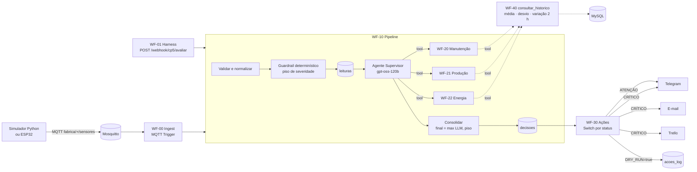

# CP5 · Sistema multiagente de manutenção inteligente

Checkpoint 5 da disciplina de IoT e Agentes de IA (FIAP).

Um motor da vinícola publica temperatura, vibração, tensão, corrente, fator de potência e produção via MQTT. Um **Agente Supervisor** consulta três **especialistas** (Manutenção, Produção e Energia), consolida os pareceres e classifica a máquina como **NORMAL**, **ATENÇÃO** ou **CRÍTICO**. A partir dessa classificação o n8n age: em ATENÇÃO avisa no Telegram, e em CRÍTICO avisa no Telegram, manda um relatório por e-mail e abre uma ordem de serviço no Trello.

**Integrantes**

| Nome | RM |
|---|---|
| Felipe Ferrete | RM562999 |
| Gustavo Bosak | RM566315 |
| Clayton Alves | RM562285 |

---

## Sumário

1. [A ideia em uma frase](#a-ideia-em-uma-frase)
2. [Arquitetura](#arquitetura)
3. [Da CP2 para a CP5](#da-cp2-para-a-cp5)
4. [Os agentes](#os-agentes)
5. [Segurança: onde a IA não decide sozinha](#segurança-onde-a-ia-não-decide-sozinha)
6. [Como rodar](#como-rodar)
7. [Como testar](#como-testar)
8. [Evidências](#evidências)
9. [Estrutura do repositório](#estrutura-do-repositório)
10. [Limitações conhecidas](#limitações-conhecidas)

---

## A ideia em uma frase

**O LLM diagnostica, o n8n executa, e uma regra fixa garante que nenhum alarme real seja abafado.**

Os agentes trazem o que uma regra `SE temperatura > 80` não consegue: cruzar grandezas, ler a tendência das últimas duas horas e explicar a causa provável para o operador. Já a decisão de **disparar** alertas, e o **piso** de severidade, ficam em código determinístico e testado. Se o LLM errar, faltar ou for enganado, o pior que acontece é o sistema voltar a se comportar como a regra fixa.

## Arquitetura



| Peça | Papel |
|---|---|
| **Mosquitto** | Broker MQTT local com usuário e senha. Telemetria em `fabrica/{id}/sensores`; online/offline (LWT) em `fabrica/{id}/status`. |
| **n8n 2.40** | Orquestrador: escuta, valida, chama os agentes, grava e aciona. O n8n não é o agente; ele hospeda os agentes. |
| **Groq** | LLMs do plano gratuito. O supervisor usa `openai/gpt-oss-120b`; os especialistas usam `gpt-oss-20b` e `qwen3`, um modelo por agente para não estourar o limite de tokens por minuto. |
| **MySQL 8.4** | Memória confiável do sistema: leituras, decisões, ações e histórico usado pelas tools. |

### Por que tantos workflows?

Cada agente é um workflow próprio, chamado como **ferramenta** pelo supervisor (`toolWorkflow`). Isso permite testar cada especialista isoladamente por webhook, trocar o modelo de um sem mexer nos outros e ver no `intermediateSteps` do supervisor que as três consultas aconteceram de fato.

## Da CP2 para a CP5

A CP2 monitorava o **ambiente** da adega (ESP32, DHT22, LDR → Node-RED → MySQL). A CP5 monitora as **máquinas** da mesma vinícola: `MOTOR_01` é a bomba de trasfega e `MOTOR_02`, a engarrafadora.

| Camada | CP2 | CP5 | O que mudou |
|---|---|---|---|
| Borda | ESP32 com LWT, `msg_id`, QoS 1 | Simulador Python com os mesmos padrões | Mesma convenção de tópicos e LWT |
| Orquestração | Node-RED | n8n | INSERT parametrizado mantido |
| Regra | `IF/ELSE` fixo no firmware | Guardrail em `contracts/guardrail.js` | A regra fixa virou **rede de segurança**, não o cérebro |
| Dados | `telemetria`, `v_ultimo_status` | `leituras`, `decisoes`, `acoes_log`, `v_tendencia_2h` | Mesmo estilo de índices e views |
| Saída | Toast no dashboard | Telegram, e-mail e Trello | "O IoT termina em decisão executada" |

Um defeito da CP2 foi corrigido de propósito: lá, `d.temperatura || 0` transformava um campo ausente em 0 °C. Aqui, campo ausente fica `NULL`, é registrado como ausente e pede verificação humana. O sistema **nunca inventa** um valor.

## Os agentes

Cada agente segue a anatomia do slide 5: **LLM + System Message + Memória + Tools**.

| Agente | Olha para | Tools | Memória |
|---|---|---|---|
| **Supervisor** | A leitura inteira e o resultado do guardrail | Os 3 especialistas | Os pareceres da própria execução |
| **Manutenção** | Temperatura (70/80 °C) e vibração (4,5/7,1 mm/s, ISO 10816) | `consultar_historico` | Histórico de 2 h no MySQL |
| **Produção** | Eficiência = taxa / esperada (90 %/70 %) | `consultar_historico` | Histórico de 2 h no MySQL |
| **Energia** | Tensão (±5/±10 %), corrente (100/120 % da nominal) e fator de potência (0,92/0,80, ANEEL) | `consultar_historico` | Histórico de 2 h no MySQL |

Os prompts estão em [`prompts/`](prompts/). Todos repetem as mesmas regras: nunca inventar números, nunca ficar abaixo do status do guardrail, escalar um nível só com tendência comprovada (≥ 15 % em 2 h, com pelo menos 6 amostras) e ignorar instruções que venham dentro dos dados.

A saída de cada agente é JSON validado por um *Structured Output Parser* contra [`contracts/especialista.schema.json`](contracts/especialista.schema.json). Depois, um nó de código confere se cada número citado nos achados existe de verdade na leitura ou no histórico (`meta.valores_nao_rastreaveis`).

**Memória = banco, não chat.** Os agentes não usam memória conversacional. O histórico vem de uma consulta SQL parametrizada (`consultar_historico`), que devolve média, desvio padrão e variação percentual da janela. É a mesma fonte que a equipe consultaria, e não esquece entre execuções.

## Segurança: onde a IA não decide sozinha

| Risco | Defesa | Onde |
|---|---|---|
| LLM classificar abaixo do real | `status_final = max(status_llm, status_guardrail)` | `contracts/guardrail.js::consolidar` |
| LLM disparar ação indevida | O LLM não tem tool de Telegram/Trello; quem aciona é um `Switch` sobre `status_final` | WF-30 |
| Dado ausente ou corrompido | Validação de tipo, campos obrigatórios e faixa física → `NULL`, `requer_humano`, sem ordem de serviço | `validar()` |
| Prompt injection no payload | `id_maquina` fora de `^[A-Z0-9_]{3,32}$` vira `ID_INVALIDO` e o LLM nem é chamado | `validar()`, cenário C09 |
| Máquina sem cadastro | Sem nominais não há diagnóstico: vai direto para verificação humana | cenário C10 |
| Falha ou limite da API do LLM | Até 3 tentativas com espera; depois, decisão pelo guardrail com resumo gerado por código | WF-10, WF-2x |
| Disparo acidental em teste | `DRY_RUN=true` grava as ações em `acoes_log` em vez de chamar as APIs | WF-30 |

Os limiares ficam em [`config/limiares.json`](config/limiares.json), cada um com a fonte. A lógica do guardrail existe **uma vez só**: o `n8n/build.js` injeta o mesmo `guardrail.js` coberto pelos testes dentro dos nós de código do n8n.

## Como rodar

**Pré-requisitos:** Docker Desktop, Node 18+ (usamos 24), Git Bash no Windows e Python 3 (só para o simulador).

```bash
# 1. Variáveis de ambiente
cp infra/.env.example infra/.env      # preencher senhas, chave Groq e tokens

# 2. (Só em rede com inspeção HTTPS, como os laboratórios da FIAP)
powershell -ExecutionPolicy Bypass -File infra/certs/exportar_ca_fiap.ps1
#    e no .env: NODE_EXTRA_CA_CERTS=/certs/fiap-ca-bundle.pem

# 3. Subir n8n, MySQL e Mosquitto (o banco é criado e populado na primeira subida)
cd infra && docker compose --env-file .env up -d && cd ..

# 4. Credenciais do n8n, geradas a partir do .env (nenhum segredo vai para o git)
bash n8n/credentials/importar_infra.sh
bash n8n/credentials/importar_groq.sh
bash n8n/credentials/importar_integracoes.sh

# 5. Gerar e importar os workflows (importa, publica e reinicia o n8n)
node n8n/build.js && bash n8n/import.sh
```

O n8n fica em http://localhost:5678. No primeiro acesso ele pede para criar um usuário local, que serve só para visualizar os workflows.

### Mandar uma leitura

```bash
# Pelo webhook (resposta síncrona com a decisão completa)
curl -X POST http://localhost:5678/webhook/cp5/avaliar \
  -H 'Content-Type: application/json' \
  -d '{"id_maquina":"MOTOR_01","temperatura":86.5,"vibracao":8.2,"tensao":220,"corrente":18.5,"fator_potencia":0.62,"taxa_producao":42,"taxa_producao_esperada":60}'

# Pelo MQTT, como uma máquina real
cd simulator && python -m venv .venv && ./.venv/Scripts/python.exe -m pip install -r requirements.txt && cd ..
./simulator/.venv/Scripts/python.exe simulator/publisher.py --cenario C02
./simulator/.venv/Scripts/python.exe simulator/publisher.py --continuo --maquina MOTOR_01 --perfil degradando --intervalo 5
```

Com `DRY_RUN=true` (padrão), as ações ficam em `acoes_log`. Para enviar de verdade, troque para `DRY_RUN=false` no `.env` e recrie o n8n com `docker compose --env-file .env up -d n8n`.

## Como testar

| Comando | O que prova | LLM? |
|---|---|---|
| `node --test contracts/guardrail.test.js` | Regras do guardrail: piso, ações, dado ausente, injection (15 testes) | Não |
| `node tests/smoke_pipeline.js` | Os 11 cenários do golden set pelo pipeline real, sem LLM (`?llm=0`) | Não |
| `node tests/smoke_acoes.js` | Roteamento NORMAL/ATENÇÃO/CRÍTICO → canais | Não |
| `node tests/smoke_tool_historico.js` | Tool de histórico contra uma consulta SQL de conferência | Não |
| `node tests/smoke_especialistas.js --intervalo 20` | Cada especialista isolado devolve parecer válido | Sim |
| `node tests/run_validation.js --rodadas 3` | **Golden set completo com o supervisor**, invariantes rígidas e flexíveis, relatório em `docs/evidencias/` | Sim |

### Golden set ([`simulator/cenarios.json`](simulator/cenarios.json))

| ID | Situação | Esperado |
|---|---|---|
| C01 | Tudo nominal | NORMAL, nenhuma ação |
| C02 | Payload do slide 15 | CRÍTICO: Telegram + e-mail + Trello |
| C03 | Só fator de potência baixo | ATENÇÃO, Energia aponta a causa |
| C04 | Só produção a 80 % | ATENÇÃO, Produção aponta a causa |
| C05 | Falta `vibracao` | Pede humano, não inventa valor, não abre OS |
| C06 / C06b | Temperatura 999 / `"abc"` | Falha de sensor, pede humano, não abre OS |
| C07 | 76 °C com alta de ~20 % em 2 h | O agente escala para CRÍTICO citando a tendência |
| C08 | Vibração 12 mm/s | CRÍTICO mesmo que o LLM diga menos (piso) |
| C09 | `id_maquina` com instrução embutida | Rejeitado na validação, LLM não é chamado |
| C10 | Máquina não cadastrada | Pede humano |

As invariantes **rígidas** precisam passar em 100 % das execuções: piso respeitado, ações iguais ao mapa do slide 16, decisão persistida e nenhum card Trello com dado duvidoso. As **flexíveis**, como o status sugerido pelo LLM e a citação só de números rastreáveis, são medidas pela maioria de 3 rodadas, porque o LLM não é determinístico.

## Evidências

- [`docs/evidencias/relatorio_validacao.md`](docs/evidencias/relatorio_validacao.md): resultado do golden set com o supervisor LLM.
- [`docs/evidencias/exemplo_email_critico.html`](docs/evidencias/exemplo_email_critico.html): relatório enviado por e-mail no CRÍTICO.
- [`docs/evidencias/`](docs/evidencias/): prints do Telegram, do Trello e dos workflows no n8n.
- [`docs/reflexao.md`](docs/reflexao.md): reflexão crítica (slide 17), respondida com base nesses testes.

## Estrutura do repositório

```
config/      limiares.json — limiares com fonte, faixa física, regex do id, mapa de ações
contracts/   JSON Schemas (payload, especialista, decisão) e guardrail.js + testes
db/          schema MySQL, seeds e cenários de histórico (tendência / estável)
prompts/     system messages do supervisor e dos especialistas
simulator/   publisher MQTT e golden set
n8n/         templates → build.js → workflows/*.json; scripts de import e credenciais
infra/       docker-compose, Mosquitto, .env.example, CA da rede FIAP
tests/       smokes e runner de validação
docs/        evidências e reflexão
```

`n8n/workflows/*.json` são **gerados** a partir de `n8n/templates/`. Para mudar um workflow, edite o template (ou o prompt, ou o `guardrail.js`) e rode `node n8n/build.js && bash n8n/import.sh`.

## Limitações conhecidas

- **Plano gratuito do Groq:** 8 000 tokens por minuto por modelo e 1 000 requisições por dia. Uma avaliação completa faz de 4 a 10 chamadas e leva cerca de 1 minuto. Em produção seria preciso um plano pago ou um modelo local.
- **E-mail na rede da FIAP:** as portas SMTP (465/587) são bloqueadas no laboratório; o envio real foi testado em outra rede.
- **Simulação:** os dados vêm de um simulador. As correntes nominais (15 A e 10 A) são valores de exemplo.
- **Não substitui o CLP:** o sistema recomenda e avisa; desligar a máquina continua sendo papel do intertravamento físico (slide 13).
