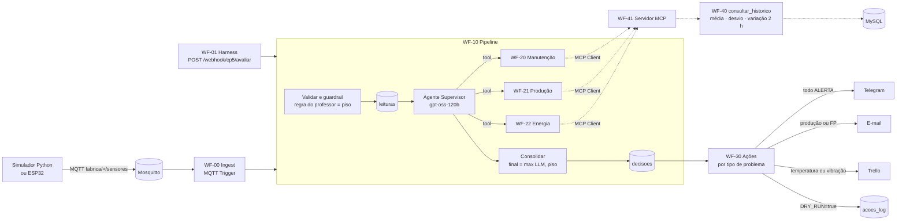

# CP5 · Sistema multiagente de manutenção inteligente

Checkpoint 5 da disciplina de IoT e Agentes de IA (FIAP).

Um motor da vinícola publica temperatura, vibração, tensão, corrente, fator de potência e produção via MQTT. Um **Agente Supervisor** consulta três **especialistas** (Manutenção, Produção e Energia), que buscam o histórico da máquina por um **servidor MCP**. O sistema classifica a máquina como **NORMAL** ou **ALERTA**, lista os problemas encontrados e escreve uma recomendação. Em ALERTA, o n8n avisa no Telegram e, conforme o tipo de problema, manda o relatório por e-mail e abre uma ordem de serviço no Trello.

**Integrantes**

| Nome | RM |
|---|---|
| Felipe Ferrete | RM562999 |
| Gustavo Bosak | RM566315 |
| Clayton Alves | RM562285 |

---

## Sumário

1. [A ideia em uma frase](#a-ideia-em-uma-frase)
2. [Tarefas do enunciado e onde estão](#tarefas-do-enunciado-e-onde-estão)
3. [Arquitetura](#arquitetura)
4. [Classificação, problemas e ações](#classificação-problemas-e-ações)
5. [Os agentes](#os-agentes)
6. [Servidor MCP](#servidor-mcp)
7. [Segurança: onde a IA não decide sozinha](#segurança-onde-a-ia-não-decide-sozinha)
8. [Da CP2 para a CP5](#da-cp2-para-a-cp5)
9. [Como rodar](#como-rodar)
10. [Como testar](#como-testar)
11. [Roteiro da demonstração](#roteiro-da-demonstração)
12. [Evidências](#evidências)
13. [Estrutura do repositório](#estrutura-do-repositório)
14. [Limitações conhecidas](#limitações-conhecidas)

---

## A ideia em uma frase

**O LLM diagnostica, o n8n executa, e a regra do professor garante que nenhum alarme real seja abafado.**

As quatro condições de alerta do enunciado ficam em código determinístico e testado. Os agentes acrescentam o que uma regra `SE temperatura > 80` não consegue: ler a tendência das últimas duas horas, cruzar grandezas e explicar a causa provável com uma recomendação. Se o LLM errar, faltar ou for enganado, o pior que acontece é o sistema voltar a se comportar como a regra fixa.

## Tarefas do enunciado e onde estão

| # | Tarefa | Onde está no sistema |
|---|---|---|
| 1 | Receber os dados por MQTT | WF-00 assina `fabrica/+/sensores` no Mosquitto; `simulator/publisher.py` publica |
| 2 | Alerta se temperatura > 80 °C, vibração > 7, FP < 0,70 ou produção < 80 % da esperada | [`config/limiares.json`](config/limiares.json) e `guardrail()` em [`contracts/guardrail.js`](contracts/guardrail.js) |
| 3 | Classificar como NORMAL ou ALERTA | Campo `situacao` da decisão, calculado em `consolidar()` |
| 4 | Informar os problemas identificados | Campo `problemas[]` e o texto `relatorio`, no formato do enunciado |
| 5 | Agente que recebe, analisa, identifica, classifica e recomenda | Supervisor (WF-10) + especialistas (WF-20/21/22); campo `recomendacao` |
| 6 | Três testes, com Telegram e e-mail, usando servidor MCP | C01, C11/C08 e C03/C04 do golden set; servidor MCP no WF-41 ([tabela de testes](#os-três-testes-do-enunciado)) |
| 7 | Vídeo ou demonstração ao vivo | [Roteiro da demonstração](#roteiro-da-demonstração) |

## Arquitetura



| Peça | Papel |
|---|---|
| **Mosquitto** | Broker MQTT local com usuário e senha. Telemetria em `fabrica/{id}/sensores`; online/offline (LWT) em `fabrica/{id}/status`. |
| **n8n 2.40** | Orquestrador: escuta, valida, chama os agentes, grava e aciona. O n8n não é o agente; ele hospeda os agentes. |
| **Groq** | LLMs do plano gratuito. O supervisor usa `openai/gpt-oss-120b`; os especialistas usam `gpt-oss-20b` e `qwen3`, para não estourar o limite de tokens por minuto, que é por modelo. |
| **MySQL 8.4** | Memória confiável do sistema: leituras, decisões, ações e o histórico que os agentes consultam. |

### O caminho de uma leitura

1. O WF-00 recebe a mensagem MQTT (ou o WF-01 recebe por HTTP, nos testes) e chama o WF-10.
2. `validar()` confere tipos, campos obrigatórios, faixa física e o padrão do `id_maquina`. `guardrail()` aplica os limites e define o **piso**.
3. A leitura é gravada em `leituras`. Valor inválido entra como `NULL`.
4. Se o dado é válido, o **Supervisor** chama os três especialistas. Cada um consulta o histórico pelo MCP e devolve um parecer JSON.
5. `consolidar()` calcula `status_final = max(status_llm, piso)`, a situação, os problemas, as ações e o relatório.
6. A decisão vai para `decisoes` e o WF-30 aciona os canais.

### Por que tantos workflows?

Cada agente é um workflow próprio, chamado como **ferramenta** pelo supervisor (`toolWorkflow`). Isso permite testar cada especialista isoladamente por webhook, trocar o modelo de um sem mexer nos outros e ver no `intermediateSteps` do supervisor que as três consultas aconteceram de fato. No n8n, cada arquivo de `n8n/workflows/` aparece como um item da lista de workflows.

## Classificação, problemas e ações

A situação segue o enunciado: **ALERTA** quando ao menos uma condição é atingida, **NORMAL** caso contrário. Internamente o sistema também calcula um pré-alerta (ATENÇÃO), que não gera ação nem muda a situação: ele serve para o agente ter um degrau para escalar quando vê tendência.

| Grandeza | ALERTA (enunciado) | Pré-alerta interno, sem ação | Problema informado |
|---|---|---|---|
| Temperatura | > 80 °C | > 70 °C | Temperatura elevada |
| Vibração | > 7 mm/s | > 4,5 mm/s | Vibração elevada |
| Fator de potência | < 0,70 | < 0,92 | Fator de potência baixo |
| Produção | < 80 % da esperada | < 90 % da esperada | Produção abaixo do esperado |
| Corrente (extra) | > 120 % da nominal | > 100 % | Corrente acima da nominal |
| Dados (extra) | campo ausente, valor impossível, id inválido ou máquina sem cadastro | — | Dados ausentes ou inválidos |

Os limites ficam em [`config/limiares.json`](config/limiares.json), cada um com a fonte. Mudar um limite é mudar só esse arquivo.

### O relatório

É o mesmo texto que vai para o Telegram. Saída real do sistema para o payload do enunciado (cenário C02, sem o LLM, por isso com a recomendação padrão):

```
Máquina: MOTOR_01
Situação: ALERTA
Problemas identificados:
- Temperatura elevada (86.5; limite 80)
- Vibração elevada (8.2; limite 7)
- Corrente acima da nominal (123.33; limite 120)
- Fator de potência baixo (0.62; limite 0.7)
- Produção abaixo do esperado (70; limite 80)
RECOMENDAÇÃO: Realizar inspeção do motor: rolamentos, alinhamento, ventilação e lubrificação. Verificar a instalação elétrica e a correção do fator de potência (banco de capacitores). Verificar a linha de produção: alimentação de insumos, gargalos e ajustes da máquina.
```

Com o LLM ligado, a linha RECOMENDAÇÃO é escrita pelo Supervisor a partir dos pareceres. A recomendação padrão por área só é usada quando o LLM não é chamado ou falha.

### Quem recebe o quê

| Problema | Telegram | E-mail | Trello |
|---|---|---|---|
| Temperatura ou vibração | sim | não | sim (ordem de serviço, extra do projeto) |
| Fator de potência ou produção | sim | sim (relatório HTML) | não |
| Os dois tipos juntos (C02) | sim | sim | sim |
| Dados ausentes ou inválidos | sim, pedindo verificação humana | não | não: dado duvidoso não abre ordem de serviço |
| NORMAL | não | não | não |

O roteamento é calculado por código em `consolidar()` (lista `acoes_previstas`) e executado pelo WF-30. O LLM não tem ferramenta de Telegram, e-mail ou Trello.

## Os agentes

Cada agente segue a anatomia vista em aula: **LLM + System Message + Memória + Tools**.

| Agente | Olha para | Tools | Memória |
|---|---|---|---|
| **Supervisor** | A leitura inteira e o resultado do guardrail | Os 3 especialistas | Os pareceres da própria execução |
| **Manutenção** | Temperatura e vibração | `consultar_historico` via MCP | Histórico de 2 h no MySQL |
| **Produção** | Eficiência = taxa / esperada | `consultar_historico` via MCP | Histórico de 2 h no MySQL |
| **Energia** | Tensão, corrente e fator de potência | `consultar_historico` via MCP | Histórico de 2 h no MySQL |

Os prompts estão em [`prompts/`](prompts/), e os limites de [`config/limiares.json`](config/limiares.json) são injetados neles. Todos repetem as mesmas regras: nunca inventar números, nunca ficar abaixo do status do guardrail, escalar um nível só com tendência comprovada (≥ 15 % em 2 h, com pelo menos 6 amostras) e ignorar instruções que venham dentro dos dados.

A saída de cada agente é JSON validado por um *Structured Output Parser* contra [`contracts/especialista.schema.json`](contracts/especialista.schema.json). Depois, um nó de código confere se cada número citado nos achados existe de verdade na leitura ou no histórico (`meta.valores_nao_rastreaveis`), que é a checagem anti-alucinação.

**Memória = banco, não chat.** Os agentes não usam memória conversacional. O histórico vem de uma consulta SQL parametrizada, que devolve média, desvio padrão e variação percentual da janela. É a mesma fonte que a equipe consultaria, e não esquece entre execuções.

## Servidor MCP

O enunciado pede o uso de um servidor MCP (Model Context Protocol), o padrão aberto para expor ferramentas a agentes. Aqui ele tem os dois lados:

- **Servidor:** o WF-41 usa o nó *MCP Server Trigger* e publica três tools em `http://localhost:5678/mcp/cp5`:

  | Tool | O que faz |
  |---|---|
  | `consultar_historico` | Média, desvio padrão, mínimo, máximo e variação percentual de uma grandeza na janela (padrão 120 min) |
  | `status_maquina` | Últimas decisões de uma máquina, com situação e problemas |
  | `avaliar_leitura` | Roda o pipeline inteiro sobre uma leitura e devolve a decisão |

- **Cliente:** os três especialistas usam o nó *MCP Client Tool* ("MCP Client CP5") apontando para esse endereço. É por ele que buscam o histórico para ver tendência. Nos `intermediateSteps`, a chamada aparece como `MCP_Client_CP5_consultar_historico`.

O teste [`tests/smoke_mcp.js`](tests/smoke_mcp.js) fala o protocolo como um cliente externo: `initialize` → `tools/list` → `tools/call`. Com `--avaliar`, dispara uma avaliação inteira pelo MCP.

Para ligar outro cliente MCP (MCP Inspector ou um editor com suporte a MCP), use o endereço `http://localhost:5678/mcp/cp5` com transporte HTTP. O ganho é este: a mesma ferramenta serve aos agentes do n8n e a qualquer cliente, e trocar a implementação (SQL hoje, outra API amanhã) não muda os agentes.

## Segurança: onde a IA não decide sozinha

| Risco | Defesa | Onde |
|---|---|---|
| LLM classificar abaixo do real | `status_final = max(status_llm, status_guardrail)` | `contracts/guardrail.js::consolidar` |
| LLM disparar ação indevida | O LLM não tem tool de Telegram, e-mail ou Trello; as ações saem de `acoes_previstas`, calculadas por código | `consolidar()`, WF-30 |
| Dado ausente ou corrompido | Validação de tipo, campos obrigatórios e faixa física → `NULL`, ALERTA com verificação humana, sem ordem de serviço | `validar()` |
| Prompt injection no payload | `id_maquina` fora de `^[A-Z0-9_]{3,32}$` vira `ID_INVALIDO` e o LLM nem é chamado | `validar()`, cenário C09 |
| Máquina sem cadastro | Sem nominais não há diagnóstico: vai direto para verificação humana | cenário C10 |
| Falha ou limite da API do LLM | Até 3 tentativas com espera; depois, decisão pelo guardrail com recomendação padrão | WF-10, WF-2x |
| Disparo acidental em teste | `DRY_RUN=true` grava as ações em `acoes_log` em vez de chamar as APIs | WF-30 |

A lógica do guardrail existe **uma vez só**: o `n8n/build.js` injeta o mesmo `guardrail.js` coberto pelos testes dentro dos nós de código do n8n.

## Da CP2 para a CP5

A CP2 monitorava o **ambiente** da adega (ESP32, DHT22, LDR → Node-RED → MySQL). A CP5 monitora as **máquinas** da mesma vinícola: `MOTOR_01` é a bomba de trasfega e `MOTOR_02`, a engarrafadora.

| Camada | CP2 | CP5 | O que mudou |
|---|---|---|---|
| Borda | ESP32 com LWT, `msg_id`, QoS 1 | Simulador Python com os mesmos padrões | Mesma convenção de tópicos e LWT |
| Orquestração | Node-RED | n8n | INSERT parametrizado mantido |
| Regra | `IF/ELSE` fixo no firmware | Guardrail em `contracts/guardrail.js` | A regra fixa virou **rede de segurança**, não o cérebro |
| Dados | `telemetria`, `v_ultimo_status` | `leituras`, `decisoes`, `acoes_log`, `v_tendencia_2h` | Mesmo estilo de índices e views |
| Saída | Toast no dashboard | Telegram, e-mail e Trello | O IoT termina em decisão executada |

Um defeito da CP2 foi corrigido de propósito: lá, `d.temperatura || 0` transformava um campo ausente em 0 °C. Aqui, campo ausente fica `NULL`, é registrado como ausente e pede verificação humana. O sistema **nunca inventa** um valor.

## Como rodar

**Pré-requisitos:** Docker Desktop, Node 18+ (usamos 24), Git Bash no Windows e Python 3 (só para o simulador).

```bash
# 1. Variáveis de ambiente
cp infra/.env.example infra/.env      # preencher senhas, chave Groq e tokens

# 2. (Só em rede com inspeção HTTPS, como os laboratórios da FIAP)
powershell -ExecutionPolicy Bypass -File infra/certs/exportar_ca_fiap.ps1
#    e no .env: NODE_EXTRA_CA_CERTS=/certs/fiap-ca-bundle.pem  (fora da FIAP: deixe vazio)

# 3. Subir n8n, MySQL e Mosquitto (o banco é criado e populado na primeira subida)
cd infra && docker compose --env-file .env up -d && cd ..
#    Na primeira vez o MySQL pode demorar mais que o healthcheck; se aparecer
#    "cp5_mysql is unhealthy", espere um minuto e rode o mesmo comando de novo.

# 4. Credenciais do n8n, geradas a partir do .env (nenhum segredo vai para o git)
bash n8n/credentials/importar_infra.sh
bash n8n/credentials/importar_groq.sh
bash n8n/credentials/importar_integracoes.sh

# 5. Gerar e importar os workflows (importa, publica e reinicia o n8n)
node n8n/build.js && bash n8n/import.sh
```

O n8n fica em http://localhost:5678. No primeiro acesso ele pede para criar um usuário local, que serve só para visualizar os workflows.

### Mandar uma leitura

```bash
# Pelo webhook (resposta síncrona com a decisão completa; ?llm=0 desliga o LLM)
curl -X POST http://localhost:5678/webhook/cp5/avaliar \
  -H 'Content-Type: application/json' \
  -d '{"id_maquina":"MOTOR_01","temperatura":86.5,"vibracao":8.2,"tensao":220,"corrente":18.5,"fator_potencia":0.62,"taxa_producao":42,"taxa_producao_esperada":60}'

# Pelo MQTT, como uma máquina real
cd simulator && python -m venv .venv && ./.venv/Scripts/python.exe -m pip install -r requirements.txt && cd ..
./simulator/.venv/Scripts/python.exe simulator/publisher.py --cenario C02
./simulator/.venv/Scripts/python.exe simulator/publisher.py --continuo --maquina MOTOR_01 --perfil degradando --intervalo 5

# Histórico de 2 h para demonstrar tendência (antes do C07) e para voltar ao normal
bash tests/semear_historico.sh tendencia
bash tests/semear_historico.sh estavel
```

Com `DRY_RUN=true` (padrão), as ações ficam em `acoes_log`. Para enviar de verdade, troque para `DRY_RUN=false` no `.env` e recrie o n8n com `cd infra && docker compose --env-file .env up -d n8n`.

## Como testar

| Comando | O que prova | LLM? |
|---|---|---|
| `node --test contracts/guardrail.test.js` | Regras do guardrail: limites, piso, dado ausente, injection, ações por tipo de problema (18 testes) | Não |
| `node tests/smoke_pipeline.js` | Os cenários do golden set pelo n8n real, sem LLM (`?llm=0`), mais texto cru no lugar de JSON (13 casos) | Não |
| `node tests/smoke_acoes.js` | O WF-30 grava 0, 1 ou 3 canais conforme a decisão | Não |
| `node tests/smoke_tool_historico.js` | Tool de histórico contra uma consulta SQL de conferência | Não |
| `node tests/smoke_mcp.js` | Servidor MCP: initialize, tools/list e tools/call | Não |
| `node tests/smoke_mcp.js --avaliar` | Uma avaliação inteira disparada por um cliente MCP | Sim |
| `node tests/smoke_especialistas.js --intervalo 20` | Cada especialista isolado devolve parecer válido | Sim |
| `node tests/run_validation.js --rodadas 3 --intervalo 15` | **Golden set completo com o supervisor**, invariantes rígidas e flexíveis, relatório em `docs/evidencias/` | Sim |

### Os três testes do enunciado

| Teste pedido | Cenário | Entrada | Resultado |
|---|---|---|---|
| Situação NORMAL | C01 | 60 °C, 2 mm/s, FP 0,95, 58/60 | NORMAL, nenhuma ação |
| ALERTA por temperatura/vibração → Telegram | C11 | temperatura 85 °C | ALERTA, Telegram (+ ordem de serviço no Trello) |
| | C08 | vibração 12 mm/s | ALERTA, Telegram (+ Trello), mesmo que o LLM diga NORMAL |
| ALERTA por produção/fator de potência → Telegram e e-mail | C03 | fator de potência 0,65 | ALERTA, Telegram + e-mail |
| | C04 | produção 42/60 = 70 % | ALERTA, Telegram + e-mail |

### Golden set completo ([`simulator/cenarios.json`](simulator/cenarios.json))

| ID | Situação | Esperado |
|---|---|---|
| C01 | Tudo nominal | NORMAL, nenhuma ação |
| C02 | Payload exato do enunciado | ALERTA, 4 problemas do enunciado (+ corrente), Telegram + e-mail + Trello |
| C03 | Fator de potência 0,65 | ALERTA, Telegram + e-mail |
| C04 | Produção a 70 % da esperada | ALERTA, Telegram + e-mail |
| C05 | Falta `vibracao` | ALERTA pedindo humano, só Telegram, não inventa valor |
| C06 / C06b | Temperatura 999 / `"abc"` | Falha de sensor, ALERTA pedindo humano, só Telegram |
| C07 | 76 °C com alta de ~20 % em 2 h | Pela regra seria NORMAL; o agente escala para ALERTA citando a tendência |
| C08 | Vibração 12 mm/s | ALERTA mesmo que o LLM diga menos (piso) |
| C09 | `id_maquina` com instrução embutida | Rejeitado na validação, LLM não é chamado |
| C10 | Máquina não cadastrada | ALERTA pedindo humano |
| C11 | Temperatura 85 °C | ALERTA, Telegram + Trello |

As invariantes **rígidas** precisam passar em 100 % das execuções: piso respeitado; situação, problemas e ações iguais aos da regra de referência; decisão persistida; nenhuma ordem de serviço com dado duvidoso. As **flexíveis**, como o status sugerido pelo LLM e a citação só de números rastreáveis, são medidas pela maioria de 3 rodadas, porque o LLM não é determinístico. Os esperados são gerados a partir do próprio guardrail por `node simulator/gerar_esperados.js`.

## Roteiro da demonstração

Cerca de 7 minutos, com `DRY_RUN=false` e o histórico estável (`bash tests/semear_historico.sh estavel`). `pub` = `./simulator/.venv/Scripts/python.exe simulator/publisher.py`.

1. **Abertura:** o problema e a arquitetura (diagrama acima).
2. **n8n:** o WF-10 (pipeline e Supervisor) e o WF-41 (servidor MCP), mais o nó MCP Client de um especialista.
3. **Teste 1:** `pub --cenario C01` → NORMAL, nada enviado.
4. **Teste 2:** `pub --cenario C11` → Telegram no formato do enunciado e card no Trello.
5. **Teste 3:** `pub --cenario C03` → Telegram e e-mail.
6. **Tendência:** `bash tests/semear_historico.sh tendencia` e `pub --cenario C07` → o agente escala para ALERTA.
7. **Raciocínio:** a execução do C07 no n8n, com os `intermediateSteps` do Supervisor chamando os três especialistas.
8. **MCP por fora:** `node tests/smoke_mcp.js`.
9. **Fechamento:** `pub --cenario C05` (dado ausente, pede humano, sem ordem de serviço), o piso de severidade e a reflexão.

## Evidências

- [`docs/evidencias/relatorio_validacao.md`](docs/evidencias/relatorio_validacao.md): resultado do golden set com o supervisor LLM.
- [`docs/evidencias/exemplo_email_critico.html`](docs/evidencias/exemplo_email_critico.html): relatório enviado por e-mail.
- [`docs/evidencias/`](docs/evidencias/): prints do Telegram, do e-mail, do Trello e dos workflows no n8n.
- [`docs/reflexao.md`](docs/reflexao.md): reflexão crítica, respondida com base nesses testes.

## Estrutura do repositório

```
config/      limiares.json — limites com fonte, faixa física, regex do id, ações por área
contracts/   JSON Schemas (payload, especialista, decisão) e guardrail.js + testes
db/          schema MySQL, seeds e cenários de histórico (tendência / estável)
prompts/     system messages do supervisor e dos especialistas
simulator/   publisher MQTT e golden set
n8n/         templates → build.js → workflows/*.json; scripts de import e credenciais
infra/       docker-compose, Mosquitto, .env.example, CA da rede FIAP
tests/       smokes, runner de validação e semear_historico.sh
docs/        enunciado, evidências e reflexão
```

`n8n/workflows/*.json` são **gerados** a partir de `n8n/templates/`. Para mudar um workflow, edite o template (ou o prompt, ou o `guardrail.js`) e rode `node n8n/build.js && bash n8n/import.sh`.

## Limitações conhecidas

- **Plano gratuito do Groq:** 8 000 tokens por minuto por modelo e 1 000 requisições por dia. Uma avaliação completa faz de 4 a 10 chamadas e leva cerca de 1 minuto. Em produção seria preciso um plano pago ou um modelo local.
- **E-mail na rede da FIAP:** as portas SMTP (465/587) são bloqueadas no laboratório; o envio real foi testado em outra rede.
- **Simulação:** os dados vêm de um simulador. As correntes nominais (15 A e 10 A) são valores de exemplo.
- **Não substitui o CLP:** o sistema recomenda e avisa; desligar a máquina continua sendo papel do intertravamento físico.
